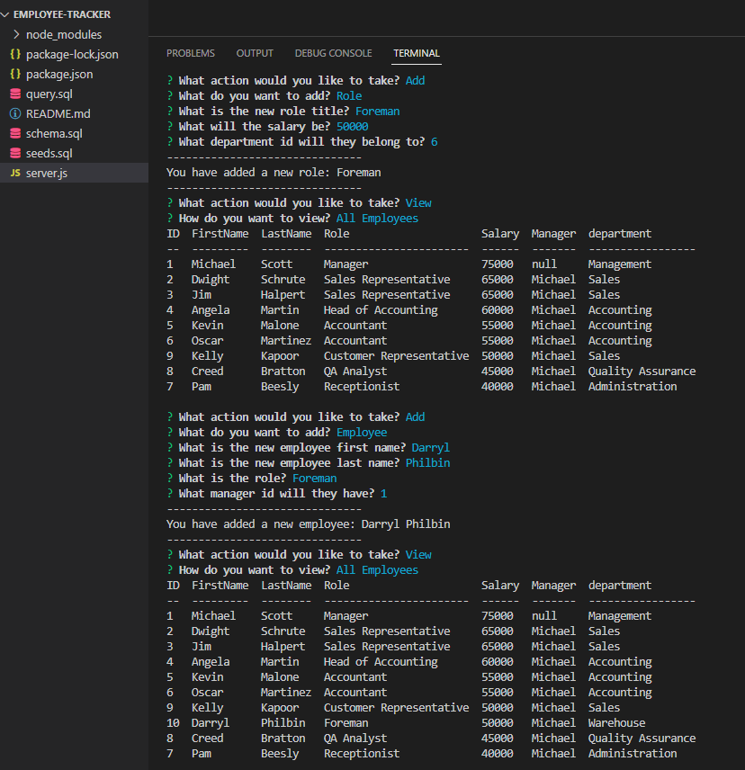

# Employee Tracker

## Description
This repository contains an application a simple Content Management System (CMS) that utilizes Inquirer, Node.js and MySQL. The user is able to view and manage the departments, roles, and employees in their company. As a fun twist, the seed values are based on characters from the popular sitcom "The Office".  

## Usage

Through the terminal, install the required tools using the following: 

```
npm i
```

Through the terminal, initialize the application using the following:

```
node server.js
```

Video demo: 

Below is a screenshot of the website. 

